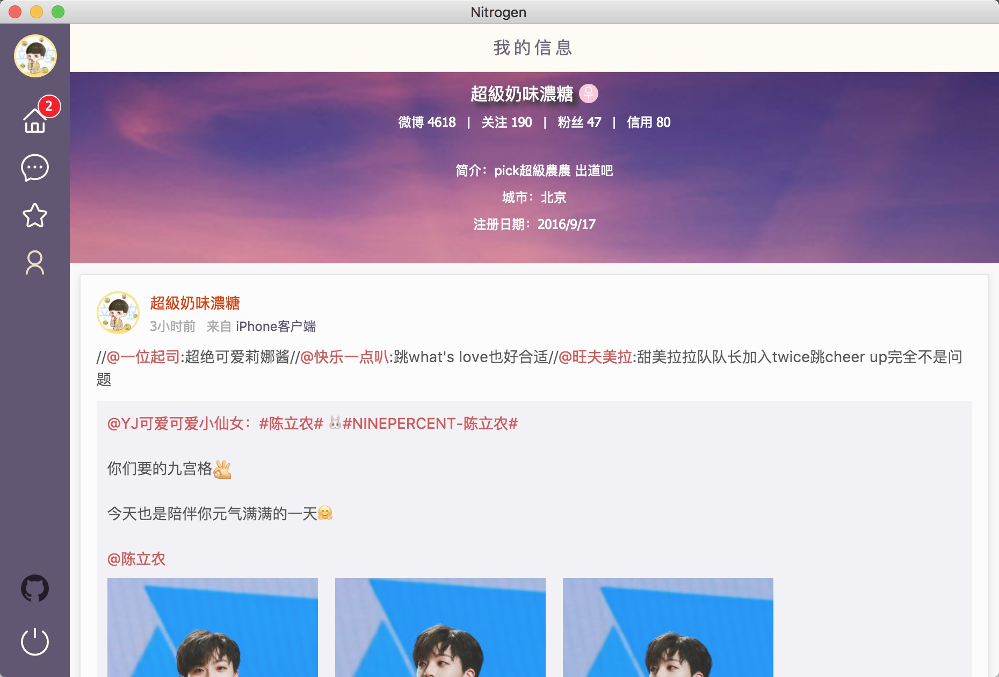

# Nitrogen

A cross platform weibo desktop app with React by Electron

## 启动命令

1. `npm run dev`

启动`webpack`来运行开发任务、构建主线程资源、渲染线程资源

2. `npm start`

开启主程序`Nitrogen`

## 构建 & 生产

`npm run build`

然后使用以下命令：

- `npm run pack`            直接运行的MacOS包
- `npm run pack:mac`        构建macOS标准安装包(.dmg)
- `npm run pack:win`        构建Windows标准安装包(.exe)

## Preview

## Thanks

[kvkens](https://github.com/kvkens)